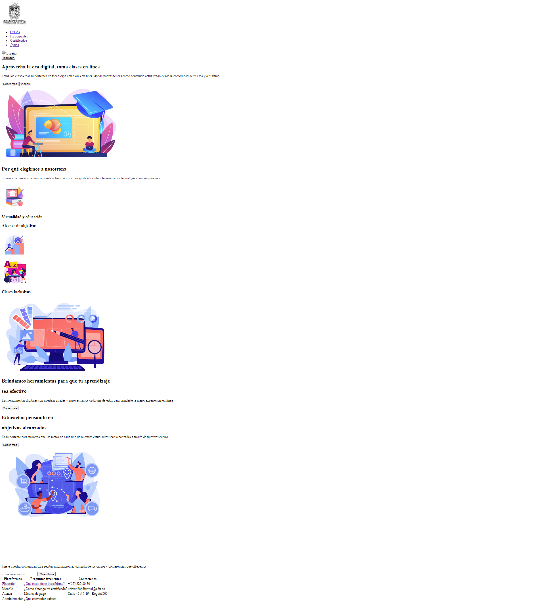
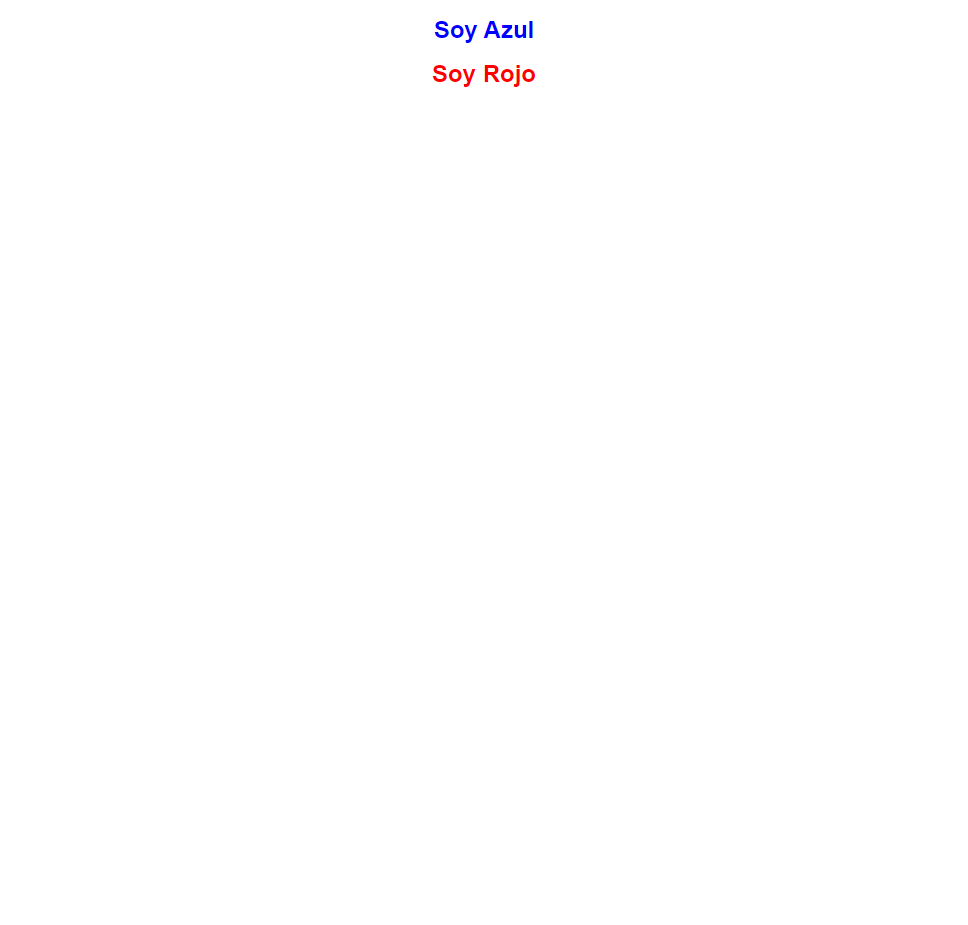
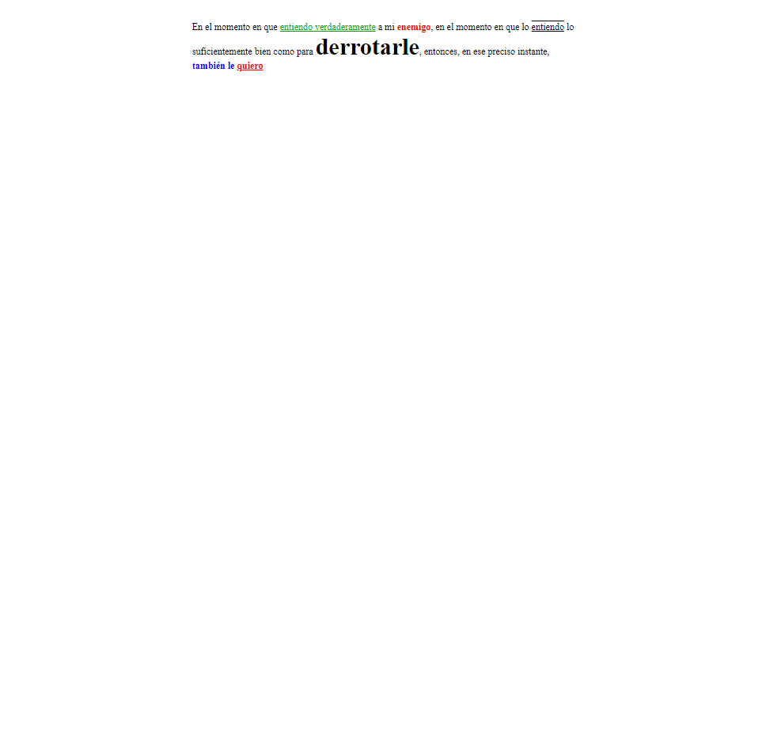
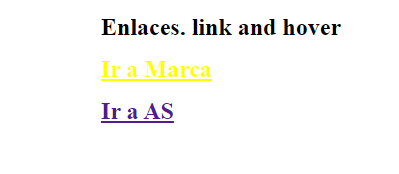
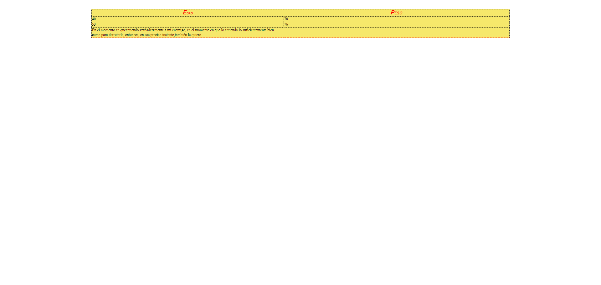

<h1>Taller 9 Jorge Luis Vidal</h1>

<h2> Información</h2>

Curso: full Stack Basico - Grupo 1

Profesor: Cristian Patiño

<h2> Punto 1: Link figma</h2>

<a href="https://www.figma.com/file/dCOOuLhVTfud2KnUOcspMt/Jorge-Vidal---Figma?type=design&node-id=0%3A1&mode=design&t=r1wc7ZEa8hBYqkoe-1" target="_blank">Link de Figma</a>

<h2>Punto 2:HTML</h2>

<h2>Punto 3:CSS</h2>

<h2>Punto 4:Titulos</h2>

<h2>Punto 5:Estilos de texto</h2>

<h2>Punto 6:Enlaces</h2>

<h2>Punto 7-8:Navegación</h2>

<h2>Punto 9:Tablas</h2>

